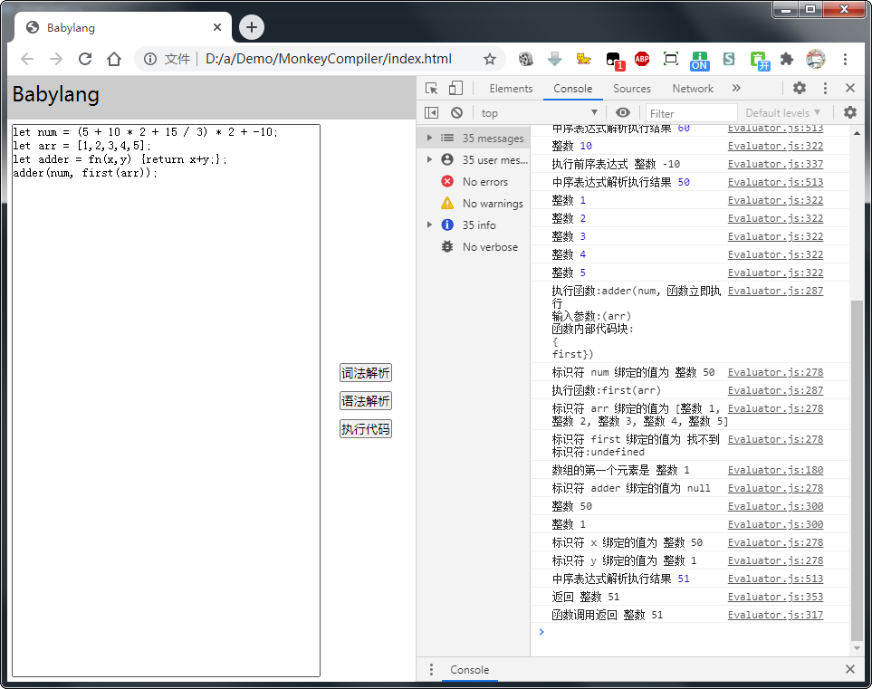

# Babylang
一个使用原生JS开发的编程语言，包括了词法分析、语法分析、解析执行的模块，不依赖任何第三方库，能让您快速入门编译原理。
## 开发环境
- 一个用于编辑代码的编辑器，推荐使用[VSCode](https://code.visualstudio.com)
- 一个现代浏览器，推荐使用[Chrome浏览器](https://www.google.cn/chrome/?standalone=1)
## 使用
双击打开index.html即可在浏览器里调试运行代码。
## 截图

## 项目许可
MIT
## 捐赠
如果本项目能对您有所帮助，欢迎打赏，以支持作者开发更多优质的项目，衷心感谢您！
